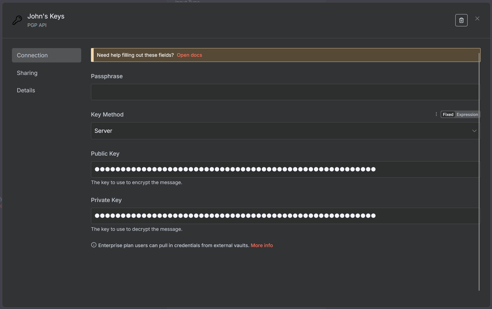
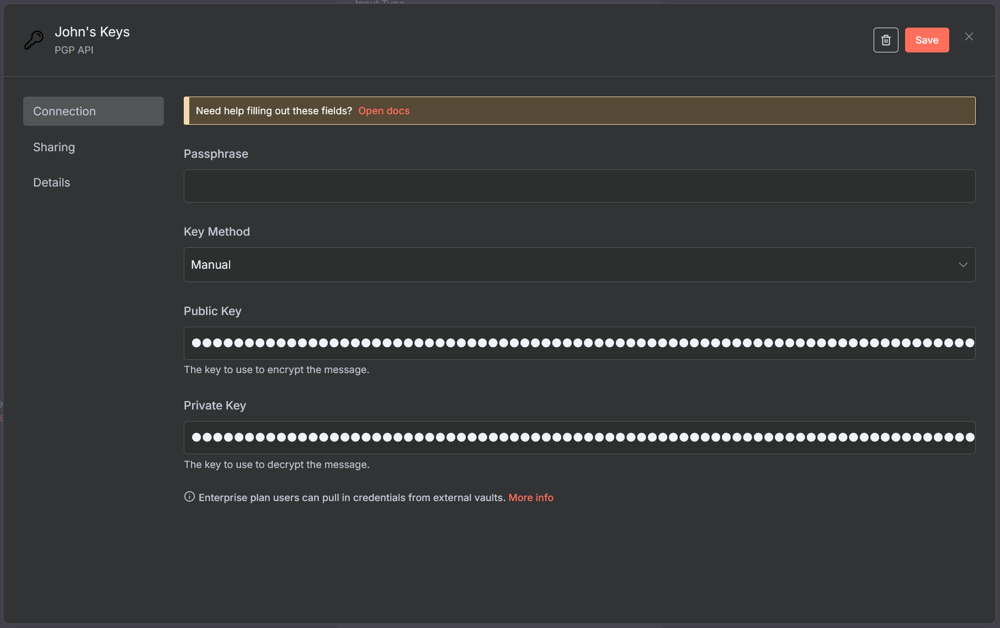
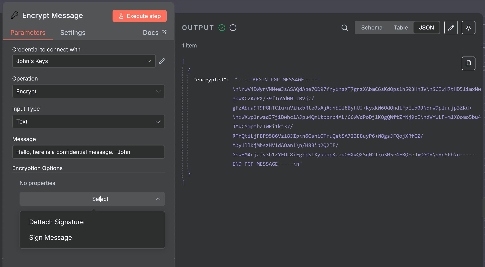
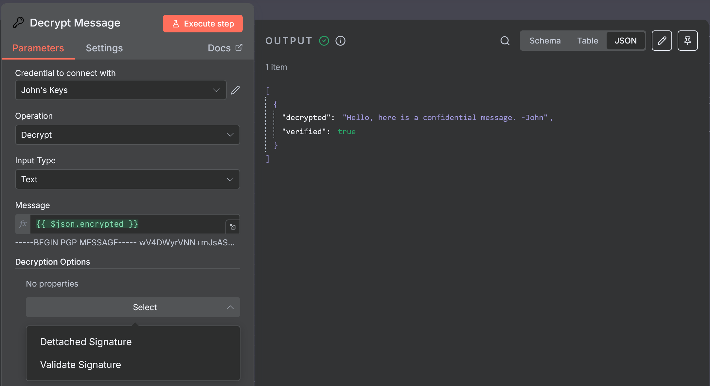
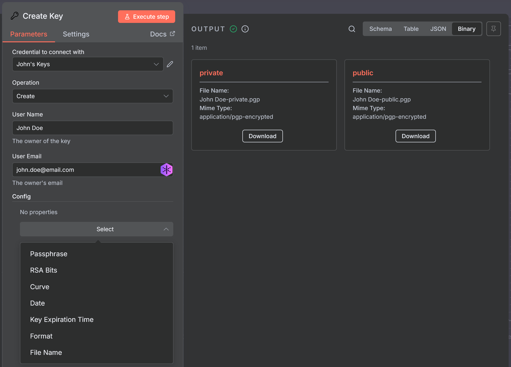

# n8n-nodes-pgp

This is an n8n community node branched from [hapheus](https://github.com/hapheus/n8n-nodes-pgp). It intergrates OpenPGP encryption and decryption into your n8n workflows.

[OpenPGP](https://www.openpgp.org/) is a standard for encryption and signing of data.

[n8n](https://n8n.io/) is a [fair-code licensed](https://docs.n8n.io/reference/license/) workflow automation platform.

## Table of Contents
* [Changes](#changes)
* [Operations](#operations)
* [Credentials](#credentials)
* [Resources](#resources)
* [Screenshots](#screenshots)
* [Installation](#installation)

## Changes
* This version of the node simplfies and streamlines encyption and decyption. Before, signing was a separate file/output, since he has added support to bake into the encryption, but here it is by default with added support for dettached signing keys.
* Removed singing, X-encrypt/decrypt-verify, and verify only options. Now there is just encypt, decrypt, and create.
* Added support for key generation: create.
* Added support for remotely hosted public and private keys. Also changed pgp to be treated like passwords in credentials.
* Added partial credential support (i.e. only filling in a public or private key). Will let user know if a key is missing only if the operation they are performing needs that key.

## Operations

- **Encrypt**: Encrypts text or binary files using a public key. Binary files can be compressed before encryption.
- **Decrypt**: Decrypts text or binary files using a private key. Compressed files are automatically decompressed after decryption.
- **Create**: Creates a pair of PGP public and private key files in plaintext. Be sure to save this if you use them.

## Credentials
To authenticate with this node, you need to provide the following credentials:
- Passphrase: The passphrase for the private key.
- Public Key: Armored public key for encryption and verification or a url pointed to where the file can be obtained.
- Private Key: Armored private key for decryption and signing or a url pointed to where the file can be obtained.

# Notes when creating credentials
* You can create partial credentials (feel in only private or public key), but will receive an error if you try to perform an operation that requires a certain key. The error will tell you which one.
* If you are familiar with PGP encryption, then you probably already know this. When creating credentials, you can use your own Public and Private key, if you will only be sending and encrypting messages to yourself. If, however, you'd like to send a message to someone, you will need their public key to encrypt message. You would also need their public key if you want to verify the message you received was from them (or at least verify they have access to the private key for the public key you have). That's why credentials are as felxible as they are so that you could potential create multiple credentials depending how you will use it. PGP assumes both parties keep their private key private, and both have access to the public key. Signing will use the credentials private key, and verifying will use the credentials public key.

## Resources

- [n8n community nodes documentation](https://docs.n8n.io/integrations/community-nodes/)
- [openpgpjs](https://openpgpjs.org/)

## Screenshots

<a>Credentials</a>

 

<a>Encryption</a>

 

<a>Decryption</a>

 

<a>Key Creation</a>

## Installation

Follow the [installation guide](https://docs.n8n.io/integrations/community-nodes/installation/) in the n8n community nodes documentation.
